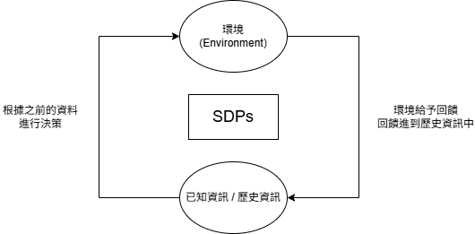

# Bridging Evolutionary Algorithms and Reinforcement Learning A Comprehensive Survey on HybridAlgorithms

## Markov Property

`機率論中的一個概念，在一個隨機過程中，給定現在狀態 以及 過去全部的狀態，未來的狀態機率分布 僅依賴於現在的狀態`

$$P(X_{t+1} = x|X_t, X_{t-1}, ..., X_{t-k}) = P(X_{t+1} = x|X_t)$$

(在已知 $[t-k, t]$ 這時間段的資訊的情況下，狀態為. $x$ 的機率 = 在已知 $[t]$ 這個時間點的資訊的情況下)

## Sequential decision-making problems (SDPs)

- 定義: 做的決策是根據歷史的經驗 (**已知的資訊、歷史資料**) 來決定的，接著環境會給予回饋，之後的決策會利用這個回饋繼續做新的決策，不斷的反覆

## Markov decision processes (MDPs)

Markov decision (馬可夫決策) 是 SDP 的子類

- 定義: 做的決策只依賴 **當下的狀態** 來決定的

$$P(s_{t+1}, r_t | s_0, a_0, ..., s_t, a_t) = P(s_{t+1}, r_t | s_t, a_t)$$

- $s_t$: 第 $t$ 步的狀態
- $a_t$: 第 $t$ 步的決策/動作 (根據 $s_t$)
- $r_t$: 執行$a_t$後，環境給予的回饋
- $s_{t+1}$: 收到回饋後的狀態
