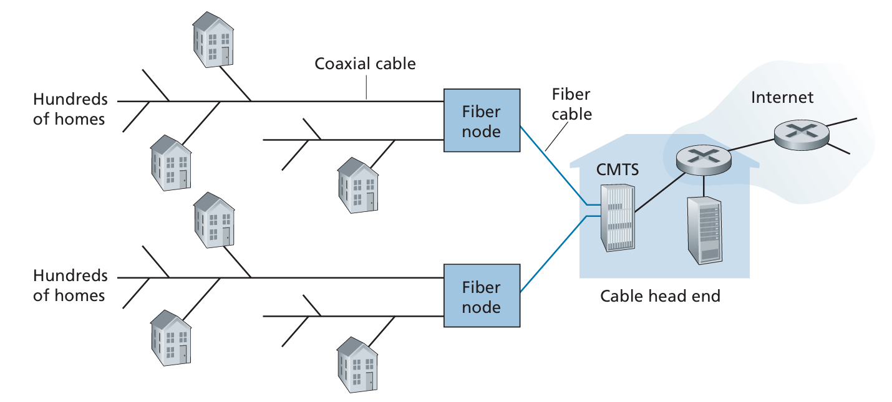
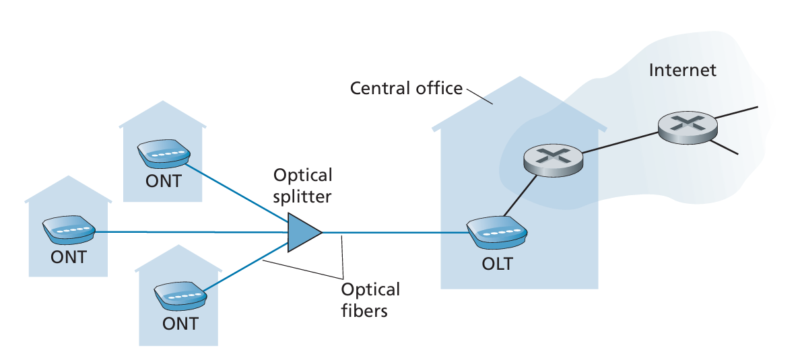
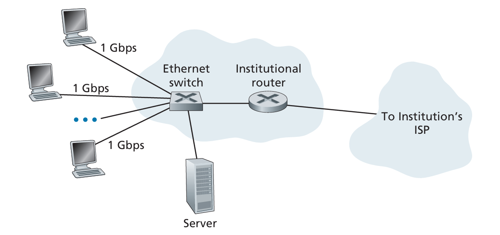

# 電腦網路與網際網路

## 網路介紹

在網路的術語中，網路邊緣的裝置被稱之為 **host** 與 **end system** (路由器/交換器屬於中間設備)
end system 之間是用 **communication links** 與 **packet switches** 連接
end system 之間傳輸的資訊稱之為 **packet(s)**
end system 透過 **Internet Service Providers (ISPs)** 來獲得網路

## packet switch (封包交換機)

一個 packet switch 會將 **輸入通訊鏈路(incoming communication link)** 傳輸過來的 packet，轉送到一條 **輸出通訊鏈路(outgoing communication link)**

*也就是說，packet switch的工作有兩件事情:*

1. 接收封包
2. **決定** 並 **轉發** 到哪個埠/連線出去

### 兩種 packet switch

#### 路由器 (Router)

使用 **IP位址** 與 **routing table (路由表)** 來決定下一跳 (next hop)
多用於 **網路核心 (network core)** ，也就是 ISP/骨幹網彼此之間的大型互連

#### 鏈路層交換器 (Link-layer switch)

使用 **MAC位址** 與 **MAC address table** 來決定要從哪一個埠送出
多用於 **存取網路 (access network)**，也就是 end system 接入的那一層

## 協定 (protocol)

protocol 規範了在通訊時, 通訊實體交換了哪些的 **訊息(message)** ，要以什麼 **次序(order)** 交換，以及收到訊息後的 **動作(action)**

`「某協定＝規範通訊實體之間的訊息格式、交換次序與對訊息的動作集合（含傳輸錯誤時的處理），例如 HTTP、TCP。」（關鍵詞：messages / order / actions）`

網路最重要的協定:

- **Transmission Control Protocol (TCP)**
- **Internet Protocol (IP)**

合稱為 **TCP/IP**

## 邊緣網路

- 為何許多裝置 (電腦、手機、電視... etc.) 被稱之為 end system?
: 因為這些裝置都網路生態的最外圍
- end system 也被稱之為 host
: 因為這些裝置會 運行(run) 或是 host 應用程式 (application programs)

host 可以被分為兩種:

- **clients**
- **servers**

**client:** 主要為一般民眾擁有的電子設備，如: 電腦、手機、平板
**server:** 主要是更強力的電子設備，像是可以儲存 Web pages、獲得使用者用瀏覽器的搜尋結果 (搜尋引擎)

## Digital Subscriber Line (DSL)

透過現有的 **電話線** 來傳輸資料，電信公司 (telco) 的 **機房 (central office)** 透過 **數位用戶線路接取多工器 (digital subscriber line access multiplexer, DSLAM)** 來分配網路給用戶

　

- **DSL modem:** DSL用的數據機。可以把電腦輸出的訊號轉換成音訊，通過電話線的高頻頻帶上傳送; 接收數據的時候可以還原成乙太網路
- **Splitter:** 分頻器。把電話線(銅線)上的頻率分割開來，0~4kHz為語音(電話)，更高頻的為DSL數據 (分割的用途為: 避免電話與DSL數據彼此干擾)
- **Existing phone line:** 你家到電信公司的 **銅雙絞線(copper twisted pair)**
- **Central office(CO):** 電信公司的機房，匯集了附近社區內所有用戶的本地迴路。機房裡面有 **語音交換設備** 與 **DSLAM**; 進來的線路會被分頻 (語音的走PSTN，數據進DSLAM)
- **DSLAM:** 會在機房內進行數據的 **解調** (將已變訊號還原成原始訊號)、速率/雜訊管理，將住戶的流量 **彙整到高速上聯**，並接到 ISP 的 IP網路/Internet
- **Internet:** 封包交換的 IP 網路。來自 DSLAM 的流量經 ISP 核心/路由器，轉送到全球服務（網站、雲端等）
- **Telephone network:** 電路交換的語音網路。家用電話的 0–4 kHz 訊號經機房語音交換機接到對方電話，與走 Internet 的數據流彼此分離但共用同一對銅線進屋

## Cable Internet Access

使用有線電視公司現有的電纜進行傳輸，這套系統會使用到 光纖(fiber cable) 與 同軸電纜(coaxial cable)，因此也稱之為 **hybrid fiber coax (HFC)**

由於 cable Internet access 是使用 **寬頻共享 (shared broadcast medium)**，從機房(head end)的下行 (downstream) 封包會沿著同一段同軸 **同時傳到所有住家**; 每一台 cable modem 只接收屬於自己的封包。住家的上行 (upstream) 封包也共用著同一上行通道回到 CMTS
這意味著當有許多住戶同時下載時，下行的頻寬會被瓜分掉，每個人分到的平均速率會低於下行速率。而當當遇到了 突發/間歇性流量的時候，若只有少數的活躍用戶，並且請求的時間沒有什麼重疊，則大家常能各自以接近通道滿速拿到資料
而因為上行通道也是共享的，因此必須用 **分散式多重存取協定(distributed multiple access protocol)** 來排隊與避碰

- **Coaxial cable:** 同軸電纜。從光節點分出去、延伸到各住家的銅纜，能夠載送 DOCSIS 數據 與 有線電視訊號
- **Fiber node:** 光節點。光⇄電/RF 轉換點，把來自機房的光訊號轉成同軸上的 RF（下行），並把住家回傳的 RF 轉回光（上行）
- **Fiber cable:** 連接光節點到機房 (head end) 的單模光纖主幹，提供遠距離、低損耗、高容量的回傳（backhaul），把多個社區的流量匯回營運商網路
- **CMTS(Cable Modem Termination System):** 機房端對應家戶Cable Modem的設備。負責 DOCSIS 實體/媒體存取控制、上行排程（TDMA/OFDM(A)）、頻道綁定、認證與 QoS，同時作為 IP 邊界把住戶流量接到 ISP/Internet
- **Cable head end:** 業者的區域機房/樞紐，放置 CMTS、路由器與內容/管理設備。多個光纖回傳在此匯集並接入營運商核心網與 Internet

## Fiber to the home (FTTH)

FTTH的概念正如其名，用一條光纖通道連結機房與住家
配線的方式有兩種

1. **Direct fiber:** 每個住戶都拉一條光纖到CO (點對點)，但是成本非常高
2. **P2MP (Point-to-Mutipoint) / Splitter-based FTTH:** CO先拉一條光纖到社區的附近，到了住家附近再 **分成多戶**

對於第二種 分光的光纖 有兩種架構

1. **AON (Active Optical Network):** 在路邊機櫃放有電源的 **乙太交換器** 等主動設備
   - `CO ──光纖──> 有電的交換器 ──多條光纖──> 各住家`
   - 優點:節點可轉送/管理，每戶一路獨立 Port，彈性高
   - 需要供電與維護，戶外設備成本/故障風險較高
2. **PON (Passive Optical Network):** 用無電源的 **光纖分路器/分光器** 把一條光纖「被動地」分成多戶：
    - `CO（OLT） ──光纖──> 被動分光器 ──多條光纖──> 各住家（ONT/ONU）`
    - 下行是廣播式，上行用 **時分多工(TDM)** 輪流發
    - 優點：路邊無需供電、外線成本低、維護簡單
    - 缺點：同段共享頻寬、光功率/分光比有設計限制

- **ONT (Optical Network Terminal):** 住家端的光纖數據機，可以把 **光訊號 ↔ 乙太網/IP** 互轉
- **Optical splitter:** 光纖分路器/分光器。是一個被動的元件，無須供電，可以把一條幹線光纖的光功率分成多條分支，雙向工作: 下行廣播到各 ONT，上行匯流回 OLT
- **Optical fibers:** 光纖。 連接 OLT ↔ 分光器 ↔ ONT 的傳輸媒介
- **OLT (Optical Line Terminal):** 在機房端的 **匯聚控制設備**。與多個 ONT 組成一個 PON，負責上行排成/動態頻寬分配

## Ethernet and WiFi

Ethernet (乙太網路) 是 local area network (LAN) 中被運用的最普及的有線技術
`LAN 負責將 end system 連接到 edge router`
而無線的 LAN 技術中，使用者在傳輸封包的時候，會經由 access point 連到企業的網路，然後連線到有線的網路

- **Ethernet switch:** 乙太網交換器，L2。 依 **MAC address table** 轉送乙太幀，不做跨網段路由。把多台 PC、伺服器匯集起來，往上連到路由器
- **Institutional router:** 全體用戶的 **Default Gateway**。負責把內部 IP 封包送往外部網路，常同時承擔 **NAT、防火牆、QoS** 等功能，並把多個內部網段彼此路由
- **To institution's ISP:** 連到機構的網際網路服務提供者。路由器對外的上行連線，流量會進入 ISP 的核心網，再到 Internet

## 電路交換(Circuit Switching) v.s. 封包交換 (Packet Switching)

- 電路交換: 先建立端到端 **保留資源** 的電路 (TDM/FDM)，期間內 **資源專用** ，但是 **沉默時段會閒置** ，並且建立電路也需額外訊號流程
- 封包交換: 資料會被切成 packet，共享鏈路，雖然 **分享效率高、成本低** ，但是 **延遲可變**
