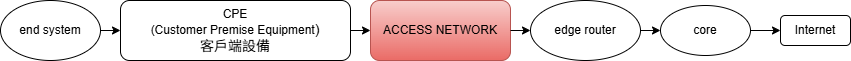
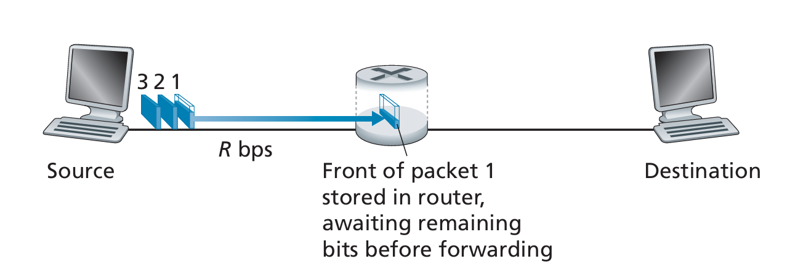
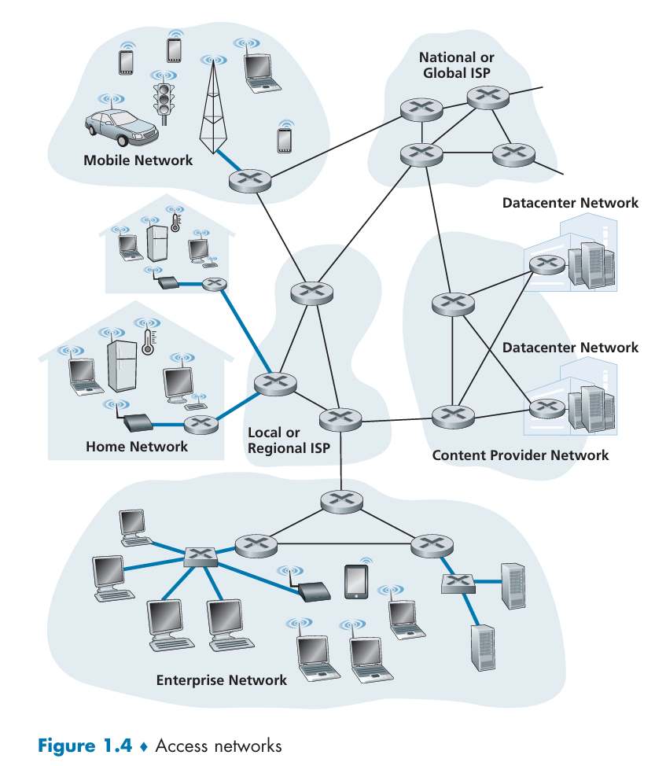
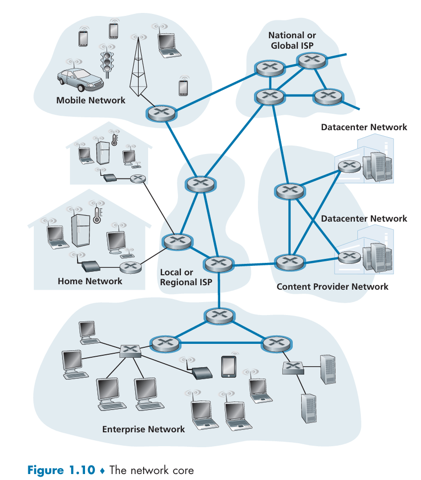
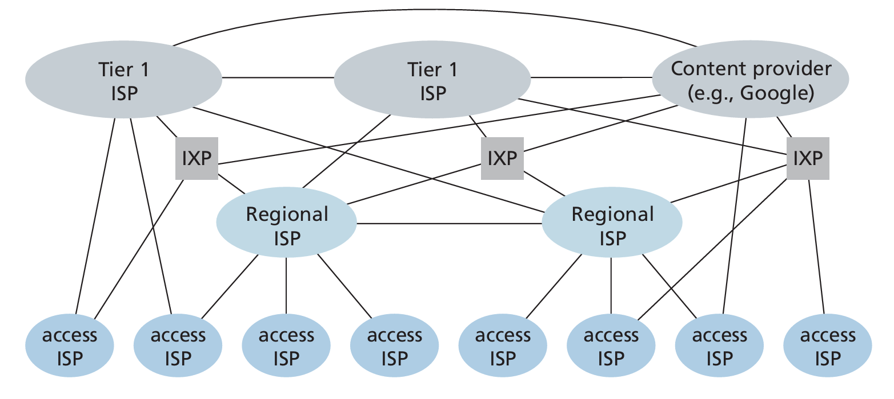

# 電腦網路與網際網路

## 網路介紹

在網路的術語中，網路邊緣的裝置被稱之為 **host** 與 **end system** (路由器/交換器屬於中間設備)

end system 之間是用 **communication links** 與 **packet switches** 連接

end system 之間傳輸的資訊稱之為 **packet(s)**

end system 透過 **Internet Service Providers (ISPs)** 來獲得網路

每一個 end system 都有自己的位址，稱之為 **IP位址 (IP address)**

## packet switch (封包交換機)

一個 packet switch 會將 **輸入通訊鏈路(incoming communication link)** 傳輸過來的 packet，轉送到一條 **輸出通訊鏈路(outgoing communication link)**

*也就是說，packet switch的工作有兩件事情:*

1. 接收封包
2. **決定** 並 **轉發** 到哪個埠/介面 (port/interface)

### 兩種 packet switch

#### 路由器 (Router)

使用 **IP位址** 與 **routing table (路由表)** 來決定下一跳 (next hop)
大量於 **網路核心 (network core)** ，也就是 ISP/骨幹網彼此之間的大型互連

#### 鏈路層交換器 (Link-layer switch)

使用 **MAC位址** 與 **MAC address table** 來決定要從哪一個埠送出
大量於 **存取網路 (access network)**，也就是 end system 接入的那一層

## 協定 (protocol)

protocol 規範了在通訊時, 通訊實體交換了哪些的 **訊息(message)** ，要以什麼 **次序(order)** 交換，以及收到訊息後的 **動作(action)**

`「某協定＝規範通訊實體之間的訊息格式、交換次序與對訊息的動作集合（含傳輸錯誤時的處理），例如 HTTP、TCP。」（關鍵詞：messages / order / actions）`

網路最重要的協定:

- **Transmission Control Protocol (TCP)**
- **Internet Protocol (IP)**

合稱為 **TCP/IP**

## The Network Edge

Network edge 是 **端點進出 "網際網路" 的地方**

- 為何許多裝置 (電腦、手機、電視... etc.) 被稱之為 end system?
: 因為這些裝置都網路生態的最外圍
- end system 也被稱之為 host
: 因為這些裝置會 運行(run) 或是 host 應用程式 (application programs)

host 可以被分為兩種:

- **clients**
- **servers**

**client:** 主要為一般民眾擁有的電子設備，如: 電腦、手機、平板

**server:** 主要是更強力的電子設備，像是可以儲存 Web pages、獲得使用者用瀏覽器的搜尋結果 (搜尋引擎)

### Access Networks

Access Network 是將 end system 連接到第一個 router (**edge router**) 的 **那一段網路**

以下有4個常見的 Access Network

### 1. Digital Subscriber Line (DSL)

透過現有的 **電話線** 來傳輸資料，電信公司 (telco) 的 **機房 (central office)** 透過 **數位用戶線路接取多工器 (digital subscriber line access multiplexer, DSLAM)** 來分配網路給用戶

- **DSL modem:** DSL用的數據機。可以把電腦輸出的訊號轉換成音訊，通過電話線的高頻頻帶上傳送； 接收數據的時候可以還原成 Ethernet 幀/訊號
- **Splitter:** 分頻器。把電話線(銅線)上的頻率分割開來，0~4kHz為語音(電話)，更高頻的為DSL數據 (分割的用途為: 避免電話與DSL數據彼此干擾)
- **Existing phone line:** 你家到電信公司的 **銅雙絞線(copper twisted pair)**
- **Central office(CO):** 電信公司的機房，匯集了附近社區內所有用戶的本地迴路。機房裡面有 **語音交換設備** 與 **DSLAM**； 進來的線路會被分頻 (語音的走PSTN，數據進DSLAM)
- **DSLAM:** 會在機房內進行數據的 **解調** (將已變訊號還原成原始訊號)、速率/雜訊管理，將住戶的流量 **彙整到高速上聯**，並接到 ISP 的 IP網路/Internet
- **Internet:** 封包交換的 IP 網路。來自 DSLAM 的流量經 ISP 核心/路由器，轉送到全球服務（網站、雲端等）
- **Telephone network:** 電路交換的語音網路。家用電話的 0–4 kHz 訊號經機房語音交換機接到對方電話，與走 Internet 的數據流彼此分離但共用同一對銅線進屋

### 2. Cable Internet Access

使用有線電視公司現有的電纜進行傳輸，這套系統會使用到 光纖(fiber cable) 與 同軸電纜(coaxial cable)，因此也稱之為 **hybrid fiber coax (HFC)**

由於 cable Internet access 是使用 **寬頻共享 (shared broadcast medium)**，從機房(head end)的下行 (downstream) 封包會沿著同一段同軸 **同時傳到所有住家**； 每一台 cable modem 只接收屬於自己的封包。住家的上行 (upstream) 封包也共用著同一上行通道回到 CMTS

這意味著當有許多住戶同時下載時，下行的頻寬會被瓜分掉，每個人分到的平均速率會低於下行速率。而當當遇到了 突發/間歇性流量的時候，若只有少數的活躍用戶，並且請求的時間沒有什麼重疊，則大家常能各自以接近通道滿速拿到資料

而因為上行通道也是共享的，因此必須用 **分散式多重存取協定(distributed multiple access protocol)** 來排隊與避碰

- **Coaxial cable:** 同軸電纜。從光節點分出去、延伸到各住家的銅纜，能夠載送 DOCSIS 數據 與 有線電視訊號
- **Fiber node:** 光節點。光⇄電/RF 轉換點，把來自機房的光訊號轉成同軸上的 RF（下行），並把住家回傳的 RF 轉回光（上行）
- **Fiber cable:** 連接光節點到機房 (head end) 的單模光纖主幹，提供遠距離、低損耗、高容量的回傳（backhaul），把多個社區的流量匯回營運商網路
- **CMTS(Cable Modem Termination System):** 機房端對應家戶Cable Modem的設備。負責 DOCSIS 實體/媒體存取控制、上行排程（TDMA/OFDM(A)）、頻道綁定、認證與 QoS，同時作為 IP 邊界把住戶流量接到 ISP/Internet
- **Cable head end:** 業者的區域機房/樞紐，放置 CMTS、路由器與內容/管理設備。多個光纖回傳在此匯集並接入營運商核心網與 Internet

### 3. Fiber to the home (FTTH)

FTTH的概念正如其名，用一條光纖通道連結機房與住家
配線的方式有兩種

1. **Direct fiber:** 每個住戶都拉一條光纖到CO (點對點)，但是成本非常高
2. **P2MP (Point-to-Multipoint) / Splitter-based FTTH:** CO先拉一條光纖到社區的附近，到了住家附近再 **分成多戶**

對於第二種 分光的光纖 有兩種架構

1. **AON (Active Optical Network):** 在路邊機櫃放有電源的 **乙太交換器** 等主動設備
   - `CO ──光纖──> 有電的交換器 ──多條光纖──> 各住家`
   - 優點:節點可轉送/管理，每戶一路獨立 Port，彈性高
   - 需要供電與維護，戶外設備成本/故障風險較高
2. **PON (Passive Optical Network):** 用無電源的 **光纖分光器** 把一條光纖「被動地」分成多戶：
    - `CO（OLT） ──光纖──> 被動分光器 ──多條光纖──> 各住家（ONT/ONU）`
    - 下行是廣播式，上行用 **時分多工(TDM)** 輪流發
    - 優點：路邊無需供電、外線成本低、維護簡單
    - 缺點：同段共享頻寬、光功率/分光比有設計限制

- **ONT (Optical Network Terminal):** 住家端的光纖數據機，可以把 **光訊號 ↔ 乙太網路/IP** 互轉
- **Optical splitter:** 光纖分光器。是一個被動的元件，無須供電，可以把一條幹線光纖的光功率分成多條分支，雙向工作: 下行廣播到各 ONT，上行匯流回 OLT
- **Optical fibers:** 光纖。 連接 OLT ↔ 光纖分光器 ↔ ONT 的傳輸媒介
- **OLT (Optical Line Terminal):** 在機房端的 **匯聚控制設備**。與多個 ONT 組成一個 PON，負責上行排程/動態頻寬分配

### 4. Ethernet and WiFi

Ethernet (乙太網路) 是 local area network (LAN) 中被運用的最普及的有線技術
`LAN 負責將 end system 連接到 edge router`
而無線的 LAN 技術中，使用者在傳輸封包的時候，會經由 access point 連到企業的網路，然後連線到有線的網路

- **Ethernet switch:** 乙太網交換器，L2。 依 **MAC address table** 轉送乙太幀，不做跨網段路由。把多台 PC、伺服器匯集起來，往上連到路由器
- **Institutional router:** 全體用戶的 **Default Gateway**。負責把內部 IP 封包送往外部網路，常同時承擔 **NAT、防火牆、QoS** 等功能，並把多個內部網段彼此路由
- **To institution's ISP:** 連到機構的網際網路服務提供者。路由器對外的上行連線，流量會進入 ISP 的核心網，再到 Internet

## Network Core

Network core 是指 ISP 與 骨幹路由器 之間互相連通的網路，這個網路非常的高速，並且以 **轉送 (forward)** 為主

### Store-and-forward Transmission

絕大多數的 packet switches 都是使用 store-and-forward transimission，這個傳輸方式是讓 packet switch 收到完整的封包之前，不能輸出；換句話就是說，**要等到封包完整抵達後才能開始決定轉發**

使用 store-and-forward 的理由:

- **錯誤偵測:** 乙太網路 FCS/CRC 在「幀尾」。要到手整個幀才能驗證並丟掉壞幀，避免把錯誤擴散到下一跳
- **爭用與排隊:** 多個輸入要搶同一輸出、或速率不匹配（例如 10G→1G）時，必須有 **緩衝（buffer）** 與排程

### Queuing Delays and Packet Loss

packet switch 有自己的 **output buffer / output queue**，用來儲存 router 準備傳送的資料。

當有封包抵達 packet switch，但是 packet switch 現在正忙著傳輸別的資料，這時封包就要先去 output buffer 等待，這個等待就是 **queuing delay**

並且 output buffer 的容量有限，當 output buffer 滿的時候，新進來的封包就會 **遺失**，形成 **packet loss**，這時會捨棄剛抵達的封包 或是 在 buffer 裡面部分的封包

### Forwarding table

end system 向另一個 end system 發出封包的時候，封包裡面會記錄目的地的 **IP位址**，而 router 裡面有一個 **forwarding table**，用來映射 IP位址 與 outbound link，這樣當一個封包抵達 router 的時候，router 就可以透過查詢 forwarding table，來找出最合適的 outbound link，然後將封包從這個 outbound link 傳送出去

### 電路交換 (Circuit Switching) v.s. 封包交換 (Packet Switching)

- 電路交換: 先建立端到端 **保留資源** 的電路 (TDM/FDM)，期間內 **資源專用** ，但是 **沉默時段(silent periods)會閒置** ，並且建立電路也需額外訊號流程
- 封包交換: 資料會被切成 packet，共享鏈路，雖然 **分享效率高、成本低** ，但是 **延遲可變**

## Network Edge v.s. Network Core

---

## NETWORKS

- 互聯網的本質＝「網路的網路」：終端（end systems）先連到各自的 access ISP，但要彼此通訊，access ISP 之間還必須互連；直接做成「完全互連的網狀」太昂貴，所以發展出分層式結構
- Network Structure 1：所有 access ISP 接到單一「全球 transit ISP」。access ISP 付費給全球 ISP，形成 customer（客戶）／provider（供應者）關係，費率與交換流量相關
- Network Structure 2：出現多個全球 transit ISP，access ISP 可以比較價格與服務來選擇；但各全球 ISP 必須彼此互連，否則各自的客戶不能互通
- Network Structure 3（多層分級）：現實中全球 ISP 不可能「到處都有」，因此在區域層級會有 regional ISP；access→regional→tier-1（頂層）。約有十多家 tier-1（例：Level 3、AT&T、Sprint、NTT）；各層都是 customer-provider 付費關係
- 為更貼近真實網路，加入四個關鍵要素（形成 Network Structure 4）：
  - PoP（Point of Presence）：供顧客網路接入供應者網路的一組路由器據點
  - Multihoming（多宿主）：同時連多個上游，提高可靠性與韌性
  - Peering（對等互連）：同層 ISP 直接互連，流量不走上游；通常「settlement-free」不互相收費
  - IXP（Internet Exchange Point）：第三方設立的交換點，讓多家 ISP 進行 peering；全球 600+
- Network Structure 5（今日的網際網路）：加入大型內容供應商的「內容提供者網路」。以 Google 為例，自建全球私有 TCP/IP 網路互連大型與小型資料中心；盡量在 IXPs 或直接與較低層 ISP 對等以繞過上層，但仍需與 tier-1 相連並付費；這麼做可降低上層成本並更掌控服務品質
- 總結
    1. 互聯網是多層 ISP 的經濟體系：下層付費給上層、上層彼此互連；使用者與內容提供者是下層 ISP 的客戶。
    2. 這種結構的演進主要受「經濟與國家政策」驅動，不只是效能考量

## Delay in Packet-Switched Networks

有4種 Delay

1. **processing delay**
2. **queuing delay**
3. **transmission delay**
4. **propagation delay**

以上的延遲累加起來就是 **total nodal delay**

### *Processing Delay*

交換機在驗證封包的header與決定使用哪一個outbound link，所產生的延遲

### *Queueing Delay*

封包在等待被傳輸時，所等待的時間就是 queuing delay

### *Transmission Delay*

交換機將封包的資料推到線路裡面所花費的時間

### *Propagation Delay*

在物理媒介中傳輸時的時間 (取決於材質與距離)

## Protocol Layering

### 1. 分層的核心觀念：Service Model

- **分層目的**：讓協定與實作有結構、好討論、好更新。設計時關注「這一層對上層提供什麼服務？」（service model）
- **工作方式**：第 n 層用第 n−1 層的服務，再加上自己的功能（例如在不可靠的下層上實作可靠傳輸）
- **實作位置**：可以在軟體、硬體或混合；常見：應用層/傳輸層在端系統軟體，實體層/資料鏈結層多在網卡，網路層常混合；同一層的協定分散在端系統、路由器、交換器等元件中

### 2. Internet 協定堆疊：五層各管什麼？

**堆疊名稱**：Physical、Link、Network、Transport、Application

- **Application（應用層）**：放網路應用與協定，如 HTTP、SMTP、FTP、DNS；應用層資料單位稱 Message
- **Transport（傳輸層）**：TCP / UDP 把應用訊息送到對端應用
  - **TCP**：連線導向、可靠傳輸、流量控制、壅塞控制、切割長訊息成 Segments
  - **UDP**：無連線、不保證可靠/流控/壅塞控制
- **Network（網路層）**：跨主機搬運 Datagram（IP 封包）；IP 定義欄位與處理規則，是把網際網路黏在一起的「膠」，同時有路由協定決定路徑
- **Link（資料鏈結層）**：在相鄰節點間搬運整個框架 Frame；是否提供「每一跳可靠」視各連結協定（如 Ethernet、Wi-Fi、DOCSIS）。注意：這與 TCP 的端到端可靠不同
- **Physical（實體層）**：把 位元（bits） 在實際媒介（雙絞銅線、同軸、光纖…）上送到下一個節點

### 3. 為什麼要分層？

- **優點**：概念清楚、模組化、易於更新/替換（能換實作不動介面）
- **缺點**：
    1. **功能重複**（例如鏈結層與傳輸層都做錯誤恢復）
    2. **跨層資訊需求**（某層需要另一層的時間戳等），違反嚴格分離
