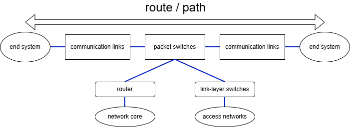

# 電腦網路與網際網路

## 網路介紹

在網路的術語中，所有的裝置都被稱之為 **host** 與 **end system**
end system 之間是用 **communication links** 與 **packet switches** 連接
end system 之間傳輸的資訊稱之為 **packet(s)**

## packet switch (封包交換機)

一個 packet switch 會將 **輸入通訊鏈路(incoming communication link)** 傳輸過來的 packet，轉送到一條 **輸出通訊鏈路(outgoing communication link)**

也就是說，packet switch的工作有兩件事情:

1. 接收封包
2. 決定封包要 **轉發(forward)** 到哪一個 埠/連線

### 兩種 packet switch

#### 路由器 (Router)

使用 **IP位址** 與 **routing table (路由表)** 來決定目的地
多用於 **網路核心 (network core)** ，也就是 ISP/骨幹網彼此之間的大型互連

#### 鏈路層交換器 (Link-layer switch)

使用 **MAC位址** 與 **MAC address table** 來決定要從哪一個埠送出
多用於 **存取網路 (access network)**，也就是 end system 接入的那一層

## 協定 (protocol)

protocol 規範了在通訊時, 通訊實體交換了哪些的 **訊息(message)** ，要以什麼 **次序(order)** 交換，以及收到訊息後的 **動作(action)**

`「某協定＝規範通訊實體之間的訊息格式、交換次序與對訊息的動作集合（含傳輸錯誤時的處理），例如 HTTP、TCP。」（關鍵詞：messages / order / actions）`

## 電路交換(Circuit Switching) v.s. 封包交換 (Packet Switching)

- 電路交換: 先建立端到端 **保留資源** 的電路 (TDM/FDM)，
