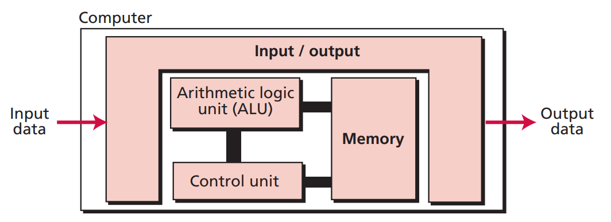

# Introduction

---

## Turning machine

### What is turing machine?

Turing machine is defined by its transition functions, a.k.a **programs**. It can simulate the logic of algorithm or computation that can be described in terms of **step-by-step process**.

The Turing machine is a theoretical framework that introduces the concept of a **program**, in addition to the basic components of a computing machine, such as input/output mechanisms, memory, and a processor.

### What is the function of *program* in Turing model?

The program in Turing model is a set of instructions that **tell the computer/machine what to do**.

### What would happen if there were *no program* in the Turing model?

Without a program, the machine would be unable to **interpret the input data**, making the output data **meaningless**. Additionally, it is unclear how many types or sets of operations a machine based on this model can perform. Therefore, adding the program to the model is necessary to **specify the operation** of the machine.

---

## Von Neumann model

### What is Von Neumann model?

A computer based on the Von Neumann model comprises four subsystems: ALU, control unit, memory, and input/output. The input subsystem receives input data, while the output subsystem sends results to the outside world. Both data and programs are stored in memory, with the ALU responsible for processing the data using the program. The control unit commands the other three subsystems.

### FOUR subsystems

- arithmetic logic unit (ALU): Handles the arithmetic and logical operations on data as directed by the program.
- memory: Store both data and program instructions. This includes input data, program instructions, and results of computations.
- control unit: Responsible for coordinating and directing the operations of the other subsystems based on instructions stored in memory.
- input/output: Facilitates communication between the computer and the external world, allowing input data to be received and results to be sent out.

### Feature

- The stored program concept
  - The Von Meumann model stores programs in memory, marking a significant departure from the architecture of early computers.
- Sequential execution of instructions
  - In the von Neumann model, a program consists of a set of instructions stored in memory. The constrol nit fetches, decodes, and executes these instructions sequentially, meaning they are executed one after another in the order they are sotred in memory. Although certain instructions may alter the control flow by requesting the control nit to jump to different instructions, the overall execution remains sequential.
