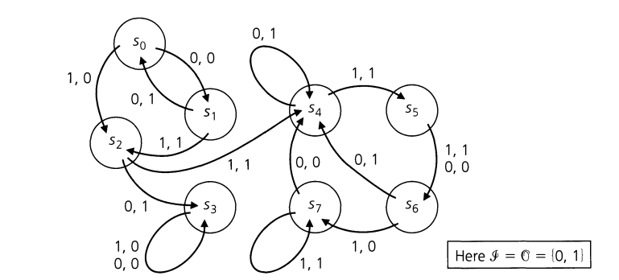
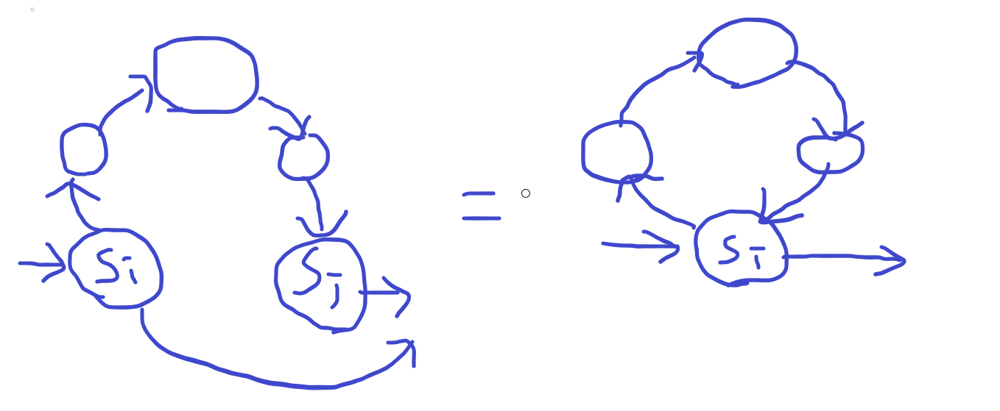

# Finite State Machine

## Definition of FSM

FSM is a five-tuple $M = \{ S, I, O, v, w \}$

- S: the set of interal states of M
- I: the set of input
- O: the set of output
- v: next state function ($ S \times I \to S $)
- w: output function ($ S \times I \to O $)

---

## How to work ?

Given the FSM $M = \{ S, I, O, v, w \}$, we designate a start state. With each consecutive input, the state transitions, resulting in a corresponding output.

### Example

Consider the FSM $M = \{ S, I, O, v, w \}$, where $S = \{ s_0, s_1, s_2 \}$, $I = O = \{ 0, 1 \}$, and $v, w$ are given by the state table below. $s_0$ is designated as the starting state.

|       |  v          |  w  |
|:-----:|:-----------:|:---:|
|       | 0 1         | 0 1 |
| $s_0$ | $s_0$ $s_1$ | 0 0 |
| $s_1$ | $s_2$ $s_1$ | 0 0 |
| $s_2$ | $s_0$ $s_1$ | 0 1 |

Given an input string 1010, to find the output string, we can follow these steps based on the table:
| steps | current state | current input | next state | output |
| :--:  | :-----------: | :-----------: | :--------: | :----: |
| 1 | $s_0$ | 1 | $v(s_0, 1)=s_1$ | $w(s_0, 1)=0$ |
| 2 | $s_1$ | 0 | $v(s_1, 0)=s_2$ | $w(s_1, 0)=0$ |
| 3 | $s_2$ | 1 | $v(s_2, 1)=s_1$ | $w(s_2, 1)=1$ |
| 4 | $s_1$ | 0 | $v(s_1, 0)=s_2$ | $w(s_1, 0)=0$ |

Accordingly, the output string is 0010.

---

## Serial Binary Adder

Given a pair of binary number strings, calculate the result of adding them up.  

### Rule of Addition

1. Ensure that the length of the binary strings is the same. If not, add '0' to the front of the shorter string until they have the same length.
2. There are $4 \times 2 = 8$ possible conditions when adding binary numbers:  
    **Permutation of the numbers**
    - 1 1
    - 1 0
    - 0 1
    - 0 0

    **Conditions Without Carry (No Carry 1):**  
    - 1 + 1 = 0
    - 1 + 0 = 1
    - 0 + 1 = 1
    - 0 + 0 = 0

    **Conditions With Carry (Carry 1):**
    - 1 + 1 = 1
    - 1 + 0 = 0
    - 0 + 1 = 0
    - 0 + 0 = 1

**Conclusion:** In this Finite State Machine (FSM), we require two states to indicate the carry and no carry.

- Without carry, a state transition occurs when the input is 11.
- With carry, a state transition occurs when the input is 10 or 01.

#### State Table

<table>
    <tr>
        <th rowspan="2"></th>
        <th colspan="4">v</th>
        <th colspan="4">w</th>
    </tr>
    <tr>
        <th>00</th>
        <th>01</th>
        <th>10</th>
        <th>00</th>
        <th>00</th>
        <th>01</th>
        <th>10</th>
        <th>00</th>
    </tr>
    <tr>
        <th>s0</th>
        <th>s0</th>
        <th>s0</th>
        <th>s0</th>
        <th>s1</th>
        <th>0</th>
        <th>1</th>
        <th>1</th>
        <th>0</th>
    </tr>
    <tr>
        <th>s1</th>
        <th>s0</th>
        <th>s1</th>
        <th>s1</th>
        <th>s1</th>
        <th>1</th>
        <th>0</th>
        <th>0</th>
        <th>1</th>
    </tr>

</table>

#### State Diagram

![Alt text][img]

[img]: FSM_addition.png

---

### Some Concepts of state and FSM

**Transcient state**  
A transcient state $s$ inidicate that there is no $x$ for which $v(s, x)=s$. Consequently, after transition, state s is not reachable from any other state.  

**Sink state**  
A sink state $s$ indicates that the state is trapped. Consequently, for all inputs, there is no transition occurence to sink state $s$.  

**Submachine**  
Let $M = \{ S, O, I, v, w \}$, where $S_1 \in S$, $O_1 \in O$, $I_1 \in I$, $v_1: S_1 \times I_1 = S_1$, and $w_1: S_1 \times I_1 = O_1$.  
If $M_1 = \{ S_1, O_1, I_1, v_1, w_1 \}$, we say $M_1$ is a submachine of $M$.

**Strongly connected machine**
We say the machine is strongly connected only when, for any $s_i, s_j \in S$ that $s_i$ if reachable from $s_j$.

#### Example

- transcient state: $s_2$
- sink state: $s_3$
- submachine: $S_1 = \{ s_4, s_5, s_6, s_7 \}$, $O_1 = \{ 0, 1 \}$. $M_1$ is the submachine of the machine $M$.
- strongly connected: The submachine $M_1$ is strongly connected.

---

### The limit of FSM

#### Recognize string precisely

Let $O = \{ 0, 1 \}$, and we design a machine to precisely recognize strings in the language $A = \{ 01, 0011, 000111 \} = \{ 0^i1^i | i \in \Z^+ \}$.
We expect that $w(s_0, 01) = 01$, $w(s_0, 0011) = 0011$, $w(s_0, 000111) = 000111$, and in general, $w(s_0, 0^i1^i) = 0^i1^i$.
**Note:** The first '1' in the output corresponds to the recognition of the substring 01, and the second '1' is for the recognition of the substring 0011, and so on.

Suppose there is a FSM with $n$ states that precisely recognizes the language $A = \{ 0^i1^i | i \in \Z^+ \}$.
Let $s_0 \in S$, and $|S| = n \geq 1$.
Now, consider the string $0^{n+1}1^{n+1}$, and our expectation is that the last $n+1$ elements are '1', while the rest are '0'.
However, because $n + 1 > n$, applying the **pigeonhole principle** reveals that there exist two states $s_i$ and $s_j$ where $i \lt j \lt n+1$, but $s_i = s_j$.
Consequently, states $s_i$ and $s_j$ are essentially the same, implying that the inputs from $i+1$ to $j$ are **unnecessary**.

Therefore, after removing the inputs from $i+1$ to $j$, the machine still recognizes the string $x = 0^{(n+1) - (j-i)}1^{n+1}$, indicating that the last $n+1$ elements of the output string are all still '1' and the rest are not.
As a result, this demonstrates that it is not possible to construct a FSM to precisely recognize strings in the language $A = \{ 0^i1^i | i \in \Z^+ \}$.

#### Why $i+1$ to $j$ is unneccessary?

This is due to the fact that the states from $i$ to $j-1$ or from $i+1$ to $j$ form a **cycle**.

Therefore, the states from $i+1$ to $j$ will not affect the recognition of FSM.
