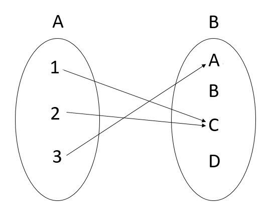

# Relation

## Binary relation

For sets A, B, any subsets of $A \times B$ is called **binary relation** from A to B. Any subsets of $A \times A$ is called **binary relation** on A.

**Note:** the word "relation" mean **binary relation** in this note.

---

## Definition of Relation

We use $(x, y) \in \mathcal{R}$ or $x \mathcal{R} y$ to indicate that x and y have the relation $\mathcal{R}$.  

---

## Demonstrate $\char"1d4ad$

$A = \{ 1, 2, 3 \}$, $B = \{ A, B, C, D \}$, $\char"1d4ad = \{ (1, C ), ( 2, C ), ( 3, A ) \}$

**Use picture to represent the $\mathcal{R}$**

**Use matrix to represent the $\mathcal{R}$**
$M_{\mathcal{R}} =
\begin{bmatrix}
0 & 0 & 1 & 0 \\
0 & 0 & 1 & 0 \\
1 & 0 & 0 & 0
\end{bmatrix}$

---

## Number of relation

Given $A = |x|$, then we have $|A| \times |A| = x^2$ number of permutation. Each permutation has two choices of existence or non-existence, resulting in $2^{x^2}$ relations on $A$.

---

## Reflexive

A relation $\char"1d4ad$ on a set $A$ is called reflexive if, for **all** $x \in A$, $(x, x) \in \char"1d4ad$.

**Note:** We say that a relation $\char"1d4ad$ is relexive **if and noly if** each element of $A$ is related to itself.  
For instance, if $A = \{ 1, 2, 3 \}$, a relation $\char"1d4ad \sube A \times A$ will be reflexive **if and only if** $\char"1d4ad \supe \{ (1, 1), (2, 2), (3, 3) \}$.  

### Example

If a FSM set $A$ with $|A| = n$. How many of relations are reflexive?  
Because $|A| = n$, we have $|A| \times |A| = n^2$. Thus, there are $2^{n^2}$ relations on $A$ .

A reflexive relation $\char"1d4ad$ includes at least $n$ elements, as each element of $A$ is related to itself. When constructing a reflexive relation $\char"1d4ad$ on $A$, considering the other $n^2 - n$ pairs in $A \times A$ (those of the form $(a_i, a_j)$, where $ i \neq j $for $ 1 \leq i, j \leq n$), we either include or exclude each of these ordered pairs. Consequently, there are $2^{n^2 - n}$ reflexive relations on $A$.

---

## Symmetric

A relation $\char"1d4ad$ on set $A$ is called symmetric if $(x, y) \in \char"1d4ad$ and $(y, x) \in \char"1d4ad $, for all $x, y \in A$.  

### Example

With $A = \{ 1, 2, 3 \}$, we have:

1. $\char"1d4ad _1 = \{ (1, 1), (2, 2), (3, 3), (3, 4) \}$, a reflexive but not symmetric relation on $A$.
2. $\char"1d4ad _2 = \{ (1,2), (2,1), (1,3), (3, 1) \}$, a symmetric but not reflexive relation on A.
3. $\char"1d4ad _3 = \{ (1,1), (2, 2), (3, 3) \}$ and $\char"1d4ad _4 = \{ (1,1), (2,2), (3,3), (2,3), (3,2) \}$ are both reflexive and symmetric relation on A.
4. $\char"1d4ad _5 = \{ (1, 1), (2, 2), (1, 3), (3, 2) \}$, a relation on A that is nethier reflexive nor symmetric.

---

## Transitive

For a a set A, a relation $\char"1d4ad$ on A is called transitive if, for all $x, y, z \in A$, $(x, y), (y, z) \in \char"1d4ad \Rightarrow (x, z) \in \char"1d4ad$.

### Example

If $A = \{ 1, 2, 3, 4 \}$, then $\char"1d4ad _1 = \{ (1, 1), (1, 2), (2, 3), (3, 4), (1, 3), (1, 4), (2, 4)\}$ is a transitive relation on $A$, whereas $\char"1d4ad = \{ (1, 3), (3, 2) \}$ is not a transitive relation on A because $(1, 3), (3, 2) \in \char"1d4ad _2$ but $(2, 3) \notin A$.

---

## Antisymmetric

Given a relation $\char"1d4ad$ on set A, $\char"1d4ad$ is called antisymmetric if $a, b \in A$, $ (a \char"1d4ad b)$ and $(b \char"1d4ad a) \Rightarrow a = b$.  
**Note:** The only way we can have a related to b and b related to a is if a and b are the same element from A.  

### Example

With $A = \{ 1, 2, 3 \}$, we have:

1. $\char"1d4ad _1 = \{ (1, 1), (2, 2), (2, 3) \}$, a antisymmetric but not symmetric relation on $A$.
2. $\char"1d4ad _2 = \{ (1, 1), (2, 2), (3, 3) \}$, a antisymmetric and symmetric relation on $A$.

---

## Partial order / Partial ordering relation

A relation $\char"1d4ad$ is called a partial order or a parital ordering relation, if $\char"1d4ad$ is **reflexive, antisymmetric and transitive**.

A set $A = \{ 1, 2, 3, 4, 6, 12 \}$ - the set of positive dividors of 12 - and define $\char"1d4ad$ on $A$ by $x \char"1d4ad y$ if $x$ exactly divides $y$.  

- Each elemet $x$ from $A$ can exactly divide itself; therefore, $\char"1d4ad$ is **reflexive**.
- If $x,y,z \in A$,
    $x$ can divide $y$, then $y=ax$, for some $ a \in \Z ^+$, and
    $y$ can divide $z$, then $z=bx$, for some $ b \in \Z ^+$.
    $\because y = ax$
    $\therefore z = by = abx$
    Consequently, $x$ can divide $z$, and $\char"1d4ad$ is **transitive**.
- If $x, y \in A$,
    $x$ can divide $y$, then $y=ax$, for some $ a \in \Z ^+$, and
    $y$ can divide $x$, then $x=by$, for some $ b \in \Z ^+$.
    Consequently, $y=ax=(ab)y$, and since $ y \ne 0$, we have $ab = 1$.
    Because $a, b \in \Z ^+$, we have $a = b = 1$, then $y = x$ and $x = y$.
    Thus, the relation $\char"1d4ad$ is **antisymmetric**.

Hence, $\char"1d4ad$ is a partial order for $A$.

After finding that $\char"1d4ad$ is a partial order, now we have to face anothor issue.

## How many the ordered pairs in this relation on $A$?

$\char"1d4ad _A = \{ (1, 1), (1, 2), (1, 3), (1, 4), (1, 6), (1, 12), (2, 2), (2, 4), (2, 6), \\ (2, 12), (3, 3), (3, 6), (3, 12), (6, 6), (6, 12), ( 12, 12) \}$

We find that there are 18 ordered pairs in $\char"1d4ad _A$; however, we should be definitely discouraged by this method of simply *listing* all the ordered pairs.
We may write $12 = 2^2 \times 3^1$ and then realize that if $(c, d) \in \char"1d4ad $, then
$$c = 2^m \times 3^n \space and \space d = 2^p \times 3^q ,$$
where $m, n, p, q \in \N$ with $0 \leq m \leq p \leq 2$ and  $0 \leq n \leq q \leq 1$.
We find that $m, p$ is simply a selection of size 2 from 3. Namely, the set $\{ 0, 1, 2 \}$ where the relations are allowed. To calculate it, there are $\dbinom{2 + 3 - 1}{2} = \dbinom{{4}}{2} = 6$ ways. And in like manner, $n$ and $q$ can be selected in $\dbinom{2+2-1}{2} = 3$ ways.
Apparently, there are $ 6 \times 3 = 18$ ordered pairs in $\char"1d4ad$ as we found by literally listing all of them.

For all $n \in \Z^+$, we can write $n = p_1 ^ {e_1} + p_2 ^ {e_2} + p_3 ^ {e_3} ... p_k ^ {e_k}$, where $k \in \Z^+$ and $p_1 \le p_2 \le p_3 \le ... \le p_k$, and $p_i$ is a prime and $e_i \in \Z^+$ for each $1 \leq i \leq k$.
Then $n$ has $\prod _{i=1} ^{k} (e_i + 1)$ positive integer dividors.

**Conclusion:** The number of ordered pairs in the relation is
$$\prod_{i=1}^{k} \dbinom{(e_i + 1) + 2 -1}{2} = \prod _{i+1} ^{k} \dbinom{e_i + 2}{2}$$

---

## Equivalance relation

An equivalance relation $\char"1d4ad$ on set $A$ that is **reflexive**, **symmetric**, and **transitive**.

### Eample

1. If $A = \{ 1, 2, 3 \}$, then
$\char"1d4ad _1 = \{ (1,1), (2, 2), (3, 3) \} $,
$\char"1d4ad _2 = \{ (1,1), (2, 2), (2, 3), (3, 2), (3, 3) \} $,
$\char"1d4ad _3 = \{ (1, 1), (1, 3), (2, 2), (3, 1), (3, 3) \} $, and
$\char"1d4ad _4 = \{ (1, 1), (1, 2), (1, 3), (2, 1), (2, 2), (2, 3), (3, 1), (3, 2), (3, 3) \}$
$ = A \times A$
are all equivalance relations on $A$.

1. Let $A = \{ 1, 2, 3, 4, 5 \}$, $B = \{ x, y, z \}$, and $ f : A \rightarrow B$ be the onto function
$$f = \{ (1, x), (2, x), (3, z), (4, y), (5, y) \}$$
Define the realtion $\char"1d4ad$ on $A$ by $a \char"1d4ad b$ if $f(a) = f(b)$.
We find that

- $\char"1d4ad$ is reflexive because $f$ is a function; then $ \forall a \in A, \space f(a) = f(a)$.
- $\char"1d4ad$ is symmectric because $ \forall a,b \in A$, if $f(a) = f(b)$ then $f(b) = f(a)$; therefore $ a \char"1d4ad b = b \char"1d4ad a$.
- $\char"1d4ad$ is transitive because $\forall a, b, c \in A$, if $f(a) = f(b)$, and $f(b) = f(c)$, then $f(a) = f(c)$.
- Therefore, $\char"1d4ad$ is an equivalance realtions.

---

## Equality relation

If $\char"1d4ad$ is a relation on $A$, then $\char"1d4ad$ is both partial order and equivalance realtion on A if and only if $\char"1d4ad$ is the equality relation on A.

### What are the characteristics of equality relation?

1. Reflexive
2. Symmetric
3. Antisymmetric
4. Transitive

**Note:** There is only one equality relation on each set $A$. In short, $ \char"1d4ad : {(x, x) \in \char"1d4ad \space | x \in A }$ is the sole equality relation on $A$. 

#### Why there is only one equality relation on set $A$ ?

- Reflexive: $\char"1d4ad : \{ (x, x) \in \char"1d4ad \space | \space \forall x \in A \}$
- Symmetric: $\char"1d4ad : \{ (x, y), (y, x) \in \char"1d4ad \space | \space \forall x, y \in A \}$
- Antisymmetric: $\forall x, y \in A$, if $(x, y)$ and $(y, x)$ $\in A$, then $x = y$
- Transitive: $\forall x, y, z \in A$, if $(x, y)$ and $(y, z)$ $\in A$, then $(x, z) \in A$

Because it is reflexive, $\char"1d4ad$ must contain $(x, x) \space | \space x \in A$.
If $(x, y)$ and $(y, x) \in \char"1d4ad \space | \space x,y \in A,  x \neq y $, it will violate the *antisymmetric* property. Consequently, if $(x, y)$ and $(y, x) \in \char"1d4ad \space | \space x, y \in A$, then $x = y$.

##### Accordinly, to be reflexive, symmetric, antisymmetric and transitive, there must be only one equality relation on set A. And the relation $\char"1d4ad : \{ (x, x) \space | \space x \in A \}$
